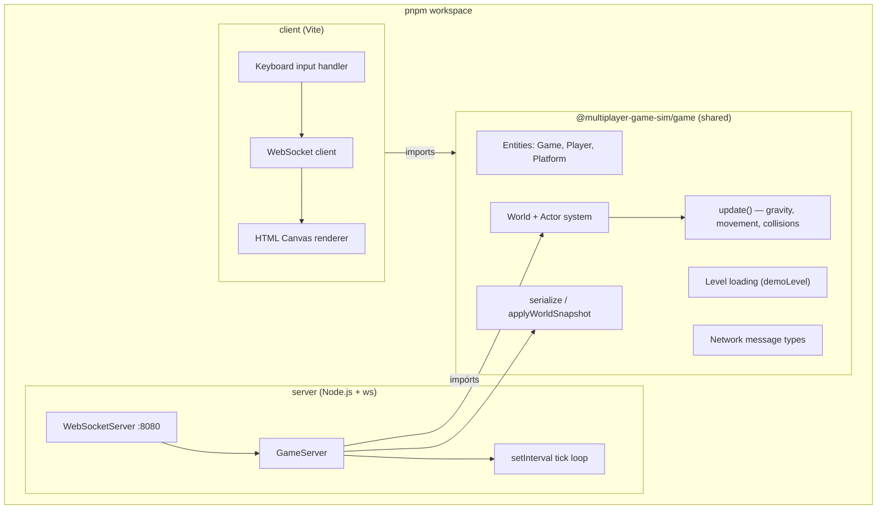
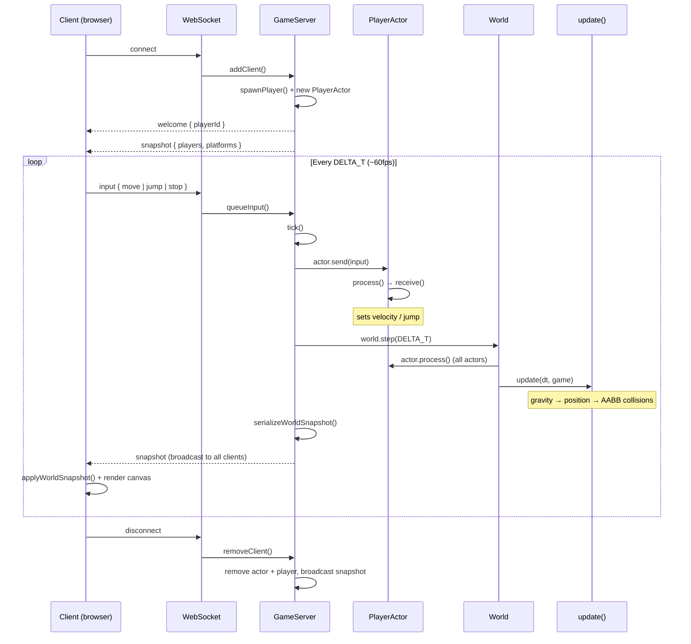
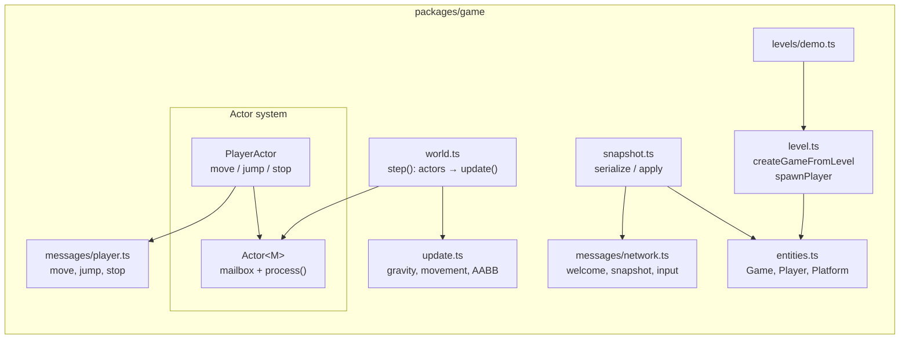

# multiplayer-game-sim

Experimenting with authoritative servers, client-side prediction, and reconciliation in real-time multiplayer systems.

## Run locally

```bash
pnpm install
pnpm dev
```

This starts:

- **Server** — authoritative simulation at `ws://localhost:8080`
- **Client** — Vite dev server (open the URL it prints, usually `http://localhost:5173`)

Open two browser tabs to see multiple players. The server runs `World.step()`; clients send input and render server snapshots.

## Architecture (Phase 1)

Phase 1 is server-authoritative: the server owns simulation, clients send input and render snapshots. Client-side prediction and reconciliation are planned but not implemented yet.

Shared game logic lives in `packages/game`.

### Monorepo layout



### Authoritative server game loop



### Shared game package internals



### Design summary

| Concern | How it's handled |
|---|---|
| **Source of truth** | Server runs `World.step()` on a fixed tick (`DELTA_T`) |
| **Input** | Client sends `PlayerActorMessage` over WebSocket; server queues per client |
| **Simulation** | `PlayerActor` applies input to velocity; `update()` handles physics and platform collisions |
| **State sync** | Server broadcasts full world snapshots; client calls `applyWorldSnapshot()` |
| **Shared logic** | Both client and server import `@multiplayer-game-sim/game` so types and simulation rules stay aligned |
